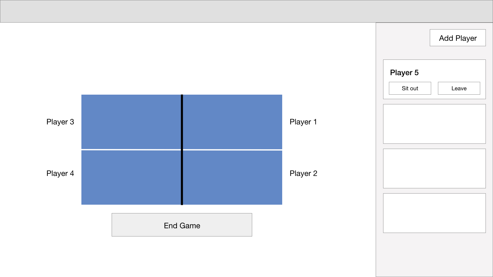

# Ping Pong 

Ping pong doubles tool for CDK Globals ping pong players

### Design mockup & plans

- Nav placeholder in case we want to continue with project and add stats
- Auto controlled table placement from player queue on the right
- 'End Game' triggers user to select which side won and then moves the losing side players back into the queue and splits the winning side
- 'Add Player' opens an input field in the same space where a player can input their name
  - List should keep track of the original ordering and who has played so it can add new players either to the top of the list or after players who haven't played yet
- Player cards have actions:
  - Sit out puts them to the bottom of the original list effectively letting them pass a turn
  - Leave pulls the player off of the list